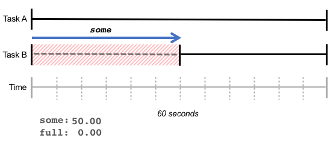
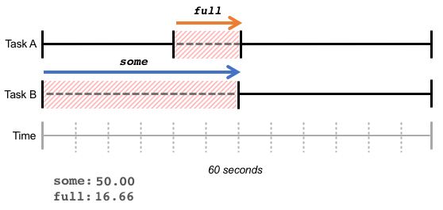

# 资源压力评估方法

https://www.cnblogs.com/Linux-tech/p/12961296.html

## load average

https://blog.csdn.net/xiaoqiaoq0/article/details/106932338

系统平均负载是指在特定时间间隔内运行队列中（在 CPU 上运行或者等待运行）的平均进程数。Linux 进程中 running 和 uninterruptible 状态进程数量加起来的占比就是当前系统 load。


算法为：

`for_each_possible_cpu(cpu)`

​    `nr_active += cpu_of(cpu)->nr_running + cpu_of(cpu)->nr_uninterruptible;`

​    `avenrun[n] = avenrun[0] * exp_n + nr_active * (1 - exp_n)`

Loadavg 有它固有的一些缺陷：

- uninterruptible的进程，**无法区分它是在等待 CPU 还是 IO**。无法精确评估单个资源的竞争程度；
- 最短的时间粒度是 1 分钟，以 5 秒间隔采样。很难精细化管理**资源竞争毛刺**和**短期过度使用**；
- 结果以进程数量呈现，还要结合 cpu 数量运算，很难直观判断当前系统资源是否紧张，是否影响任务吞吐量。

## vmpressure

在每次系统尝试做do_try_to_free_pages 回收内存时进行计算。其计算方法非常简单：

(1 - reclaimed/scanned)*100，也就是说**回收失败的内存页越多，内存压力越大**。

同时 vmpressure 提供了通知机制，用户态或内核态程序都可以注册事件通知，应对不同等级的压力。

默认定义了三级压力：low/medium/critical。low 代表正常回收；medium 代表中等压力，可能存在页交换或回写，默认值是 65%；critical 代表内存压力很大，即将 OOM，建议应用即可采取行动，默认值是 90%。

vmpressure 也有一些缺陷：

- 结果仅体现内存回收压力，不能反映**系统在申请内存上的资源等待时间**；
- 计算周期比较粗；
- 粗略的几个等级通知，无法精细化管理。


## PSI

需要在grub的cmdline中添加参数 psi=1

[root@localhost ~]# cat /proc/cmdline
BOOT_IMAGE=(hd1,gpt2)/vmlinuz-5.14.0-160.el9.x86_64 root=/dev/mapper/cs-root ro crashkernel=1G-4G:192M,4G-64G:256M,64G-:512M resume=/dev/mapper/cs-swap rd.lvm.lv=cs/root rd.lvm.lv=cs/swap rhgb quiet psi=1

 During the memcache test, CPU load was nopsi=78.05% psi=78.98% in    the first half and nopsi=77.52% psi=78.25%, so PSI added between    0.7 and 0.9 percentage points to the CPU load, a difference of    about 1%.
 在memcache测试期间，上半场CPU负载为nopsi=78.05%psi=78.98%，nopsi=77.52%psi=78.25%，因此psi在CPU负载上增加了0.7到0.9个百分点，相差约1%。

**PSI(Pressure Stall Information)** 字面意思就是由于资源（CPU、内存和 IO）压力造成的任务执行停顿。**PSI** 量化了由于硬件资源紧张造成的任务执行中断，统计了系统中任务等待硬件资源的时间。我们可以用 **PSI** 作为指标，来衡量硬件资源的压力情况。停顿的时间越长，说明资源面临的压力越大。

`[root@localhost linux]# cat /proc/pressure/cpu`
`some avg10=0.03 avg60=0.00 avg300=0.00 total=120957639`
`full avg10=0.01 avg60=0.00 avg300=0.00 total=119390710`

> **avg10=0.03** 意思是任务因为 CPU 资源的不可用，在最近的 10 秒内，有 0.03%的时间停顿等待 CPU。如果 avg 大于 40 ，也就是有 40% 时间在等待硬件资源，就说明这种资源的压力已经比较大了。
>
> **total** 是任务停顿的总时间，以微秒（microseconds）为单位。通过 total 可以检测出停顿持续太短而无法影响平均值的情况。

**some** 指标说明一个或多个任务由于等待资源而被停顿的时间百分比。



**full** 指标表示所有的任务由于等待资源而被停顿的时间百分比。在下图的例子中，在最近的 60 秒内，任务 B 等待了 30 秒的内存，任务 A 等待了 10 秒内存，并且和任务 B 的等待时间重合。在这个重合的时间段 10 秒内，任务 A 和 任务 B 都在等待内存，结果是 some 指标为 50%，full 指标为 **10/60 = 16.66%**。

**full** 表明了**总吞吐量的损失**，在这种状态下，所有任务都在等待资源，CPU 周期将被浪费。




## PSI 阈值监控

用户可以向 PSI 注册触发器，在资源压力超过自定义的阈值时获得通知。一个触发器定义了特定时间窗口内最大累积停顿时间，例如，在任何 500ms 的窗口内，累计 100ms 的停顿时间会产生一个通知事件。

```
<some|full> <停顿阈值> <时间窗口>
```

向 `/proc/pressure/io` 写入 "some 500000 1000000"，代表着在任何 1 秒的时间窗口内，如果一个或多个进程因为等待 IO 而造成的时间停顿超过了阈值 500ms，将触发通知事件。

**可以监控整个系统的压力，也可以监控特定cgroup的压力,如果这个cgroup内只有一个虚拟机，就是这个虚拟机的压力，这是some和full的结果一样**

/sys/fs/cgroup/machine.slice/machine-qemu\\x2d3\\x2dcentos7.0.scope/io.pressure

```c
#include <errno.h>
#include <fcntl.h>
#include <stdio.h>
#include <poll.h>
#include <string.h>
#include <unistd.h>

int main() {
      const char trig[] = "some 500000 1000000";
      struct pollfd fds;
      int n;

      fds.fd = open("/proc/pressure/io", O_RDWR | O_NONBLOCK);
      //fds.fd = open("/sys/fs/cgroup/machine.slice/machine-qemu\\x2d3\\x2dcentos7.0.scope/io.pressure", O_RDWR | O_NONBLOCK);
      if (fds.fd < 0) {
              printf("/proc/pressure/io open error: %s\n",
                      strerror(errno));
              return 1;
      }
      fds.events = POLLPRI;

      if (write(fds.fd, trig, strlen(trig) + 1) < 0) {
              printf("/proc/pressure/io write error: %s\n",
                      strerror(errno));
              return 1;
      }

      printf("waiting for events...\n");
      while (1) {
              n = poll(&fds, 1, -1);
              if (n < 0) {
                      printf("poll error: %s\n", strerror(errno));
                      return 1;
              }
              if (fds.revents & POLLERR) {
                      printf("got POLLERR, event source is gone\n");
                      return 0;
              }
              if (fds.revents & POLLPRI) {
                      printf("event triggered!\n");
              } else {
                      printf("unknown event received: 0x%x\n", fds.revents);
                      return 1;
              }
      }

      return 0;
}
```
