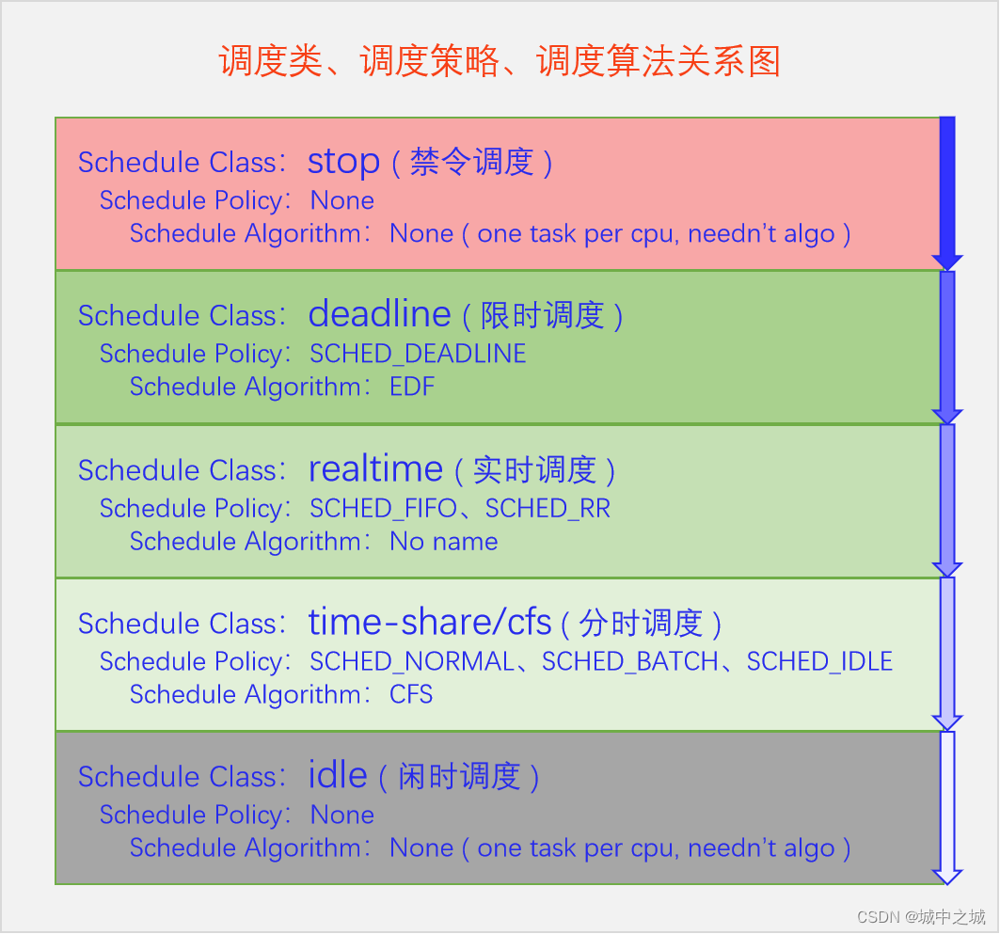
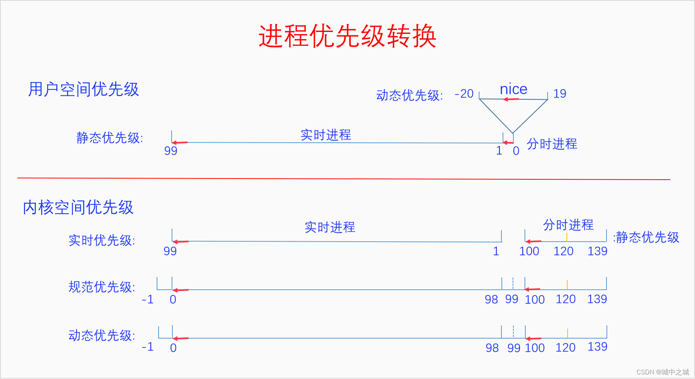
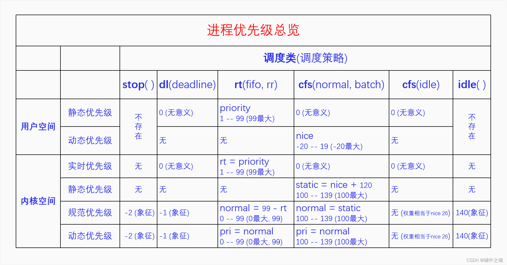
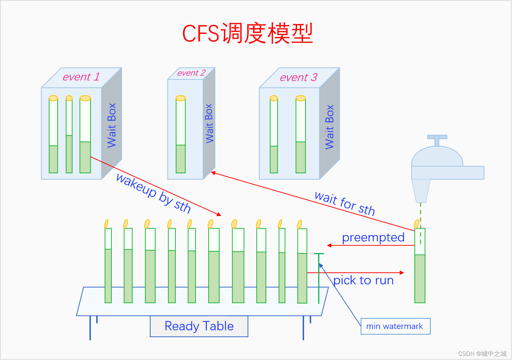
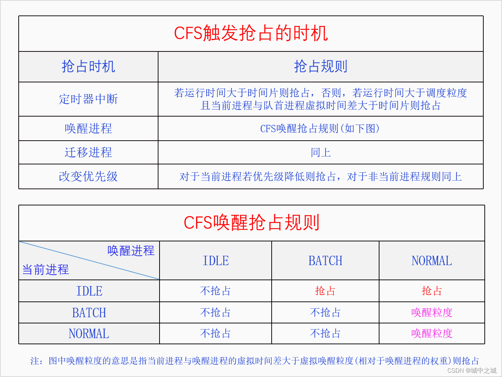

https://blog.csdn.net/orangeboyye/article/details/126109076

## 进程调度概览

进程是资源分配的单位，线程是执行的单位，进程调度调度的就是线程。

对线程的调度可以有两种方式：

一种是直接调度线程，不考虑它们所属的进程，这种方式叫做直接调度或者一级调度（Linux使用方式，计算量小的进程少开线程，计算量大的进程多开线程，相对公平）；

另一种是先调度进程，再在进程内部调度线程，这种方式叫做间接调度或者二级调度。

Linux也推出了**cgroup组调度机制**，来限制某个或者某一类进程对CPU资源的过度占用。


我们把sched_yield协作式多任务叫做主动调度，抢占式多任务叫做被动调度。

### 主动调度

触发调度和执行调度是同步的、一体的，触发即执行。主动调度发生的时机有IO等待、加锁失败等各种阻塞操作以及用户空间主动调用sched_yield。

### 被动调度

被动调度能做到的原因关键就在于中断机制，因为中断是强行在正常的执行流中插入了一段代码，它能改变后续代码的走向。
**触发调度和执行调度是异步的、分离的，触发调度并不会立马执行调度，而是做个需要调度的标记**，然后在之后的某个合适的地方会检测这个标记，如果被设置就进行调度。

#### 触发调度的点有：

在定时器中断中发现当前进程超时了

在唤醒进程时发现新进程需要抢占当前进程

在迁移进程时发现新进程需要抢占当前进程

在改变进程优先级时发现新进程需要抢占当前进程

#### 执行调度的点有：
系统调用完成之后即将返回用户空间，
中断完成之后即将返回用户空间，
如果开启了内核抢占的话则还有,**中断完成之后即将返回内核**,如果中断发生在禁止抢占临界区中，那么中断完成之后返回内核是不会执行调度的，而是会在临界区结束的时候执行调度。


### 如何调度
执行调度分为两步：一是调度算法选择下一个要执行的进程，二是切换进程。

在Linux中一共把进程分为了5类，每一类都有一个具体的算法。类之间的关系是优先选择高类的进程，只有当高类没有Runnable进程时才会去选择低类进程。

切换进程分两步：第一步是切换用户空间，第二步是切换执行栈(线程栈)。**如果要切换的两个线程属于同一个进程就不需要切换用户空间了。**
切换用户空间是一个CPU架构相关的事情，在x86 CPU上是给CR3寄存器赋值新进程的页表树的根指针。切换执行栈是线程的内核栈，执行栈代表的是当前线程的执行情况，切换执行栈就是切换线程。？？？？？？


### 调度均衡
个体均衡是从进程的角度出发选择到一个相对清闲的CPU上去运行。
**个体均衡的触发点有三个：**

一是新进程刚创建时，

二是进程要执行新程序时，

三是进程被唤醒时，

在这三个点进程都可以选择去哪个CPU的运行队列上去等待执行。

总体均衡是从CPU的角度出发如何从别的CPU上拉取一些进程到自己这来执行，使得所有CPU的工作量尽量平均。
**总体均衡的触发点有三个：**

一是CPU即将idle前会去找到最忙的CPU然后拉取一些任务过来；

二是定时器中断的周期性检测，会检查是否所有的CPU都一样忙，如果忙闲差别太大就会进行进程迁移，使得所有CPU忙闲程度接近；

三是在idle进程中如果CPU发现自己太忙而有的CPU在idle就会唤醒那个CPU进行负载均衡。


### CFS: Completely Fair Scheduler: v2.6.23 – now
不再区分IO密集型进程与CPU密集型进程，不再根据睡眠时间调整动态优先级，所有普通进程都按优先级相对平分CPU时间，算法复杂度是O(logn)。

之前的调度器是一个算法调度所有进程，在算法内部区别对待实时进程和普通进程。**现在的调度器框架是先区分不同类型的进程，普通进程一个调度类，实时进程一个调度类，调度类里面再去实现具体的调度算法。CFS是普通调度类的算法。**

## 进程调度框架

触发时机-》执行调度（选择进程、切换进程）

### 五个调度类

cfs_rq

rt_rq

dl_rq

idle

stop

内核定义了一个per-CPU变量runqueues，其类型是struct rq。所有的就绪进程都会被放入某个CPU的rq上去。五个调度类在rq中体现

### 进程唤醒

把进程放入到运行队列中，

新建唤醒wake_up_new_task 

> 先调用select_task_rq来选择自己要去哪个CPU的rq上去，
>
> 然后调用activate_task把进程加入到相应的运行队列上，
>
> 最后调用check_preempt_curr看一下是否需要抢占，如果需要就触发抢占。

阻塞唤醒try_to_wake_up

> 先检测被唤醒的进程是否为当前进程，如果是的话直接go out。
>
> 再检测进程的状态是否与state相符合，不符合就不唤醒，
>
> 再看一下进程是否已经处于唤醒状态了，如果是就没有必要唤醒了。
>
> 然后调用select_task_rq选择要到哪个CPU的运行队列上去运行，
>
> 最后调用ttwu_queue把进程放到目标运行队列上去。基本逻辑和wake_up_new_task是一样的。
>
> 
>
> 内核并不是直接用这个函数，而是提供了三个封装函数。
>
> wake_up_process是默认的通用的进程唤醒接口，能唤醒TASK_NORMAL状态的进程。TASK_NORMAL就是阻塞状态的进程，包含TASK_INTERRUPTIBLE和TASK_UNINTERRUPTIBLE，前者是睡眠能被信号唤醒，后者是深睡眠不能被信号唤醒。
>
> wake_up_state，可以自己指定唤醒什么状态的进程。如一些特殊状态的进程如被暂停的进程是不能通过wake_up_process来唤醒的
>
> default_wake_function，它是wait_queue的默认唤醒函数。


### 主动调度：

主动调度又可以分为自愿性主动调度和非自愿性主动调度。

自愿性主动调度是指进程主动调用sched_yield让出CPU，进程本身还会回到运行队列中去等待下次调度。如果运行队列中没有其它进程的话，此进程还会继续运行。

非自愿性主动调度是指进程运行时遇到了无法继续运行的情况，只能进行调度让其它进程运行。进程无法继续运行的情况有**加锁失败、要读的文件现在不在内存中、进程死亡**等。

```c
static inline int __sched __down_common(struct semaphore *sem, long state, long timeout)
{
	struct semaphore_waiter waiter;

	list_add_tail(&waiter.list, &sem->wait_list);
	waiter.task = current;
	waiter.up = false;

	for (;;) {
		if (signal_pending_state(state, current))
			goto interrupted;
		if (unlikely(timeout <= 0))
			goto timed_out;
		__set_current_state(state);
		raw_spin_unlock_irq(&sem->lock);
		timeout = schedule_timeout(timeout);
		raw_spin_lock_irq(&sem->lock);
		if (waiter.up)
			return 0;
	}

 timed_out:
	list_del(&waiter.list);
	return -ETIME;

 interrupted:
	list_del(&waiter.list);
	return -EINTR;
}
```


### 被动调度

如果进程自己不调用sched_yield，也不调用任何会阻塞的函数，那么进程岂不是就可以一直霸占着CPU了。所以内核还提供了被动调度，强制进行进程调度，避免一个进程长时间霸占CPU。被动调度是被动的，不能由进程主动去调度，所以被动调度和主动调度的模式差别很大。被动调度的过程分为两步：触发调度和执行调度。

触发调度仅仅是做个标记，告诉系统需要调度了。执行调度是系统会在某些特定的点去检查调度标记，如果被设置的话就执行调度。

触发调度的点有： 定时器中断、唤醒进程时、迁移进程时、改变进程优先级时。

执行调度的点有：

从系统调用返回用户空间syscall_exit_to_user_mode、

从中断返回用户空间irqentry_exit_to_user_mode、

从中断返回内核irqentry_exit_cond_resched、

> 所有中断和异常的入口函数都是通过DEFINE_IDTENTRY_IRQ或DEFINE_IDTENTRY(还有其它一些类似的宏)来定义的，其中一定会调用irqentry_exit。
>
> irqentry_exit又会根据寄存器状态来判断是返回到用户空间还是内核空间。
>
> 如果是返回到用户空间则会调用irqentry_exit_to_user_mode，如果是返回到内核空间则会调用irqentry_exit_cond_resched

禁用抢占临界区结束preempt_enable、

> 内核有时候为了同步，需要临时禁用抢占，这个禁用的是内核抢占，因为用户抢占永远可以。当代码配置了内核抢占时才有效。禁用抢占有引用计数，释放最后一个引用时才会重新开启内核抢占。禁用抢占和开启抢占分别用宏preempt_disable和preempt_enable。preempt_enable代表临界区的结束，会去检测是否需要调度。

禁用软中断临界区结束local_bh_enable、

> 在禁用软中断的过程中有可能其它地方已经触发了调度，因此在重新开启软中断的时候检测一下是否需要调度。
>
> 在很多比较耗时的内核操作中都会加上cond_resched调用，用来增加抢占调度的检测点，提高系统的响应性。

cond_resched调用点。


## 调度流程

```c
static void __sched notrace __schedule(unsigned int sched_mode)
{
	struct task_struct *prev, *next;
	struct rq_flags rf;
	struct rq *rq;
	int cpu;

	cpu = smp_processor_id();
	rq = cpu_rq(cpu);
	prev = rq->curr;

	next = pick_next_task(rq, prev, &rf);

	if (likely(prev != next)) {
		rq = context_switch(rq, prev, next, &rf);
	} else {
		__balance_callbacks(rq);
	}
}
```


### 选择进程：pick_next_task

内核中有调度类、调度策略、调度算法的概念，这三者是什么意思，又有什么关系呢？

调度类代表的是**进程对调度器的需求，主要是对调度紧迫性的需求**。

调度策略是调度类的子类，是对调度类的细分，是在同一个调度需求下的细微区别。

调度算法**是对调度类的实现，一个调度类一个调度算法**。同一个调度类的调度策略是有很强的相似性的，所以在同一个算法中实现，对于它们不同的部分，算法再去进行区分。下面我们画个图来看一下Linux中的所有调度类、调度策略和调度算法。



调度类之间的关系是**有高类的进程可运行的情况下，绝对不会去调度低类的进程**，只有当高类无Runnable的进程的时候才会去调度低类的进程。这里面也有一个**例外就是内核为了防止实时进程饿死普通进程，提供了一个配置参数，默认值是实时进程如果已经占用了95%的CPU时间，就会把剩余5%的CPU时间分给普通进程**。

禁令调度类和闲时调度类有特殊的目的，仅用于内核，没有调度策略，由于这类进程在内核启动时就设置好了，一个CPU一个相应的进程，所以也不需要调度算法。

> 禁令调度类的进程是内核在启动时就创建好的，一个CPU一个进程，名字叫做[migration/n]，n是CPU_ID，之后就不能再创建此类进程了。内核提供了一些接口可以向这些进程push work。调度均衡要迁移线程的时候会用到这类进程，所以它的名字叫做migration。
>
> 由于禁令调度类的进程优先级是最高的，只要此类进程变得Runnable了，就会立马抢占当前进程来运行，所以这几个接口的名字也都叫做stop_cpu、stop_machine之类的。
>
> 闲时调度类是给内核用的，当CPU没有其它进程可以执行的时候就会运行闲时调度类的进程也叫做idle进程。它在内核中有些特殊的用途，比如CPUIdle的实现就和idle进程密切相关。

另外三个调度类可用于用户空间进程，有相应的调度策略和调度算法，也有相应的API供用户空间来设置一个进程的调度策略和优先级。

> 限时调度类属于硬实时，适用于对调度时间有明确要求的进程。它只有一个调度策略，限时调度策略。一个进程必须通过系统调用才能把自己设置为限时调度策略，并且还要提供三个参数：运行周期、运行时间和截止时间。运行周期是说这个进程在多长时间内想要运行一次，运行时间是说这个进程每次想要运行多长时间，截止时间是说这个进程每次运行结束不能晚于什么时间。这三个参数都需要进程根据自己的实际情况向内核提供，而且不是说你提供了就一定能设置成功，内核还要检测与已有的限时调度类进程是否冲突，如果有冲突那就无法满足，就只能返回设置失败。还有一点是，运行时间是程序员要提供预估好的，如果程序实际运行时间超过了预估时间则会被切走，这可能会导致灾难性的后果。
>
> 实时调度类属于软实时，适用于那些只要可运行就希望立马能执行的进程，比如音视频的解码进程。实时调度类又分为两个调度策略，SCHED_FIFO和SCHED_RR。**实时调度类的内部逻辑是让实时优先级大的进程先运行，只要有实时优先级大的进程可运行，就不会去调度实时优先级小的进程**。**当两个实时进程的优先级相同时**，SCHED_RR和SCHED_FIFO这两个策略就有区别了，SCHED_FIFO进程如果抢占了CPU，它就会一直占着CPU，不会给同优先级的实时进程让CPU的，而SCHED_RR进程会在运行了一定的时间片之后主动让给同优先级的实时进程。
>
> 分时调度类是给广大的普通进程来用的，大家共同分享CPU。根据优先级的不同，可能有的进程分的多有的进程分的少，但是不会出现一个进程霸占CPU的情况。分时调度类下面有三个调度策略：SCHED_NORMAL、SCHED_BATCH和SCHED_IDLE。它们的基本思想都是分时，但是略有不同，SCHED_BATCH进程希望减少调度次数，每次调度能执行的时间长一点，SCHED_IDLE是优先级特别低的进程，其分到的CPU时间的比例非常低，但是也总是能保证分到。分时调度类现在的算法叫做CFS(完全公平调度)，所以分时调度类也叫做公平调度类。

系统为每个调度类都定义了一些标准的操作

```c
struct sched_class {
	void (*enqueue_task) (struct rq *rq, struct task_struct *p, int flags);
	void (*dequeue_task) (struct rq *rq, struct task_struct *p, int flags);
	void (*yield_task)   (struct rq *rq);
	bool (*yield_to_task)(struct rq *rq, struct task_struct *p);

	void (*check_preempt_curr)(struct rq *rq, struct task_struct *p, int flags);

	struct task_struct *(*pick_next_task)(struct rq *rq);

	void (*put_prev_task)(struct rq *rq, struct task_struct *p);
	void (*set_next_task)(struct rq *rq, struct task_struct *p, bool first);

#ifdef CONFIG_SMP
	int (*balance)(struct rq *rq, struct task_struct *prev, struct rq_flags *rf);
	int  (*select_task_rq)(struct task_struct *p, int task_cpu, int flags);

	struct task_struct * (*pick_task)(struct rq *rq);

	void (*migrate_task_rq)(struct task_struct *p, int new_cpu);

	void (*task_woken)(struct rq *this_rq, struct task_struct *task);

	void (*set_cpus_allowed)(struct task_struct *p,
				 const struct cpumask *newmask,
				 u32 flags);

	void (*rq_online)(struct rq *rq);
	void (*rq_offline)(struct rq *rq);

	struct rq *(*find_lock_rq)(struct task_struct *p, struct rq *rq);
#endif

	void (*task_tick)(struct rq *rq, struct task_struct *p, int queued);
	void (*task_fork)(struct task_struct *p);
	void (*task_dead)(struct task_struct *p);

	void (*switched_from)(struct rq *this_rq, struct task_struct *task);
	void (*switched_to)  (struct rq *this_rq, struct task_struct *task);
	void (*prio_changed) (struct rq *this_rq, struct task_struct *task, int oldprio);

	unsigned int (*get_rr_interval)(struct rq *rq, struct task_struct *task);

	void (*update_curr)(struct rq *rq);
};
```


__pick_next_task进行了一个优化，因为大部分时间系统中主要存在的都是普通进程，所以先检测运行队列的运行数量和公平运行列队中的运行数量，如果相等的话就说明系统中目前只有普通进程，那么就可以直接调用pick_next_task_fair。接着就是主逻辑了，先从高调度类进行选择，如果有可运行的进程就直接返回，如果没有就去查询下一个调度类。最后一定能返回一个进程的，因为idle进程总是可运行的。


#### 进程优先级

限时调度类用的是进程设置的三个调度参数作为调度的依据，用不到进程优先级。

只有实时调度类和分时调度类会用到进程优先级。它们使用优先级的方法也并不相同，

设置进程调度策略和优先级的API：

```c
#include <sched.h>
int sched_setscheduler(pid_t pid, int policy, const struct sched_param *param);
int sched_getscheduler(pid_t pid);

#include <sched.h>
int sched_setparam(pid_t pid, const struct sched_param *param);
int sched_getparam(pid_t pid, struct sched_param *param);

struct sched_param {
    int sched_priority;
};

#include <unistd.h>
int nice(int inc);
```

sched_setscheduler能同时设置**实时调度类和分时调度类**的**调度策略和静态优先级**，

对于实时调度类，其静态优先级范围是1-99,99最大，

对于分时调度类，其静态优先级必须设置为0，其动态优先级也就是nice需要通过nice接口来设置。

sched_setparam可以设置**实时进程的静态优先级**，对于分时进程，其静态优先级必须为0。



> 在用户空间的时候，实时进程和普通进程(分时进程)共享同一个优先级数轴，叫静态优先级，范围是0-99，值越大优先级越高，实时进程占用1-99，普通进程占用0。
>
> 普通进程自己又新开了一个数轴，叫动态优先级，也叫nice值，范围是 -20 - 19，值越低优先级越高。
>
> 到了内核空间的时候，实时进程有一个实时优先级，直接复制用户空间的静态优先级，普通进程有一个静态优先级，它是用户空间的nice值转换过来的，转换规则是nice+120。然后内核又定义了规范优先级，把它们都统一到同一个数轴上来。普通进程的规范优先级是直接复制其静态优先级，实时进程的规范优先级等于99减去它的实时优先级。在规范优先级的数轴上，所有进程都可以直接比较优先级了，值越小优先级越大。实时进程的规范优先级范围是0-99，但是由于它是从用户空间的优先级计算而来的，所以99这个值就用不到。
>
> 最后是动态优先级，对进程所有的处理都以动态优先级为准，动态优先级默认等于其规范优先级。以前的时候调度算法会去调整进程的动态优先级，现在不会再调了。现在只有使用了优先级继承锁的时候才会去调整进程的动态优先级。



有一个特殊的情况是分时调度类里面的SCHED_IDLE调度策略的进程，它的优先级无法在规范优先级数轴上体现出来，它的优先级是在CFS算法专门处理的，直接设置的调度权重，相当于是nice 26。

除了这些复杂的优先级体系之外，ps和top命令下的优先级体系也不相同。

为什么这么表示，肯定是会了看着方便，但是怎么方便的，表示是上面的那个优先级？？？？？

ps -e -o pid,cls,nice,pri,rtprio,cmd

> NI代表的是nice值，范围：-20 – 19，-20最大，只有SCHED_NORMAL和SCHED_BATCH有意义。
>
> RTPRIO代表的实时进程的用户空间优先级，范围：1 – 99，99最大，只有SCHED_FIFO和SCHED_RR有意义。
>
> PRI，普通进程 pri = 19 - nice, 实时进程 pri = 40 + rtprio，值越大优先级越大，普通进程 0 – 39， 实时进程 41 – 139。

top

> NI列是nice值，只对普通进程有效，对其它进程来说没有意义。
>
> PR，普通进程 pr = 20 + nice，实时进程 pr = -1 - rt，rt是实时进程的用户空间优先级，PR值越小优先级越大，普通进程 0 – 39，实时进程 -2 – -100，-100会显示为rt，普通进程大于等于0，实时进程小于0。

### 进程切换： context_switch

```c
static __always_inline struct rq *
context_switch(struct rq *rq, struct task_struct *prev,
	       struct task_struct *next, struct rq_flags *rf)
{
    if (!next->mm) {                                // to kernel
        enter_lazy_tlb(prev->active_mm, next);

        next->active_mm = prev->active_mm;
        if (prev->mm)                           // from user
            mmgrab(prev->active_mm);
        else
            prev->active_mm = NULL;
    } else {                                        // to user
        membarrier_switch_mm(rq, prev->active_mm, next->mm);

        switch_mm_irqs_off(prev->active_mm, next->mm, next);
        lru_gen_use_mm(next->mm);

        if (!prev->mm) {                        // from kernel
            /* will mmdrop() in finish_task_switch(). */
            rq->prev_mm = prev->active_mm;
            prev->active_mm = NULL;
        }
    }

	switch_to(prev, next, prev);
	barrier();

	return finish_task_switch(prev);
}
```

switch_mm_irqs_off-》load_new_mm_cr3-》build_cr3

切换进程地址空间就是给寄存器CR3赋予新的值。CR3中存放的是根页表的物理地址，build_cr3会把虚拟地址转化为物理地址。

切换内核栈是内核中最难理解的地方之一，难以理解的有两点：一是进程执行是如何切换的；二是switch_to宏为何有三个参数，第三个参数为啥又是prev。

```c
switch_to(prev, next, prev);

#define switch_to(prev, next, last)					\
do {									\
	((last) = __switch_to_asm((prev), (next)));			\
} while (0)
```

这是因为switch_to实际上包含了三个进程：一个是我们自己prev，一个是即将要切换的进程next，一个是我们下次继续运行时，是从哪个进程切换过来的，我们把这个进程叫做from。而**switch_to通过复用prev变量而把from变量给省略了，这就导致了理解上的混乱。**应该是这样：

```c
from = __switch_to_asm(curr, next);
```

从单个进程的角度来看，switch_to_asm会切换到next进程去执行，我们的进程就休眠了。很久以后我们的进程醒来又重新开始执行了，switch_to_asm返回的是把CPU让给我们的那个进程。

从CPU的角度来看__switch_to_asm函数前半程在curr进程运行，后半程在next进程运行。由于切换了内核栈，**所以from、curr、next这三个变量也变了，它们是不同栈上的同名的局部变量，它们的内存地址是不一样的。**当前进程中的curr值会被作为next进程中的from值返回，所以在next进程中就知道了是从哪里切换过来的了。

__switch_to_asm中最关键的两句代码我们再拿出来分析一下。
linux-src/arch/x86/entry/entry_64.S

```c
	/* switch stack */
	movq	%rsp, TASK_threadsp(%rdi)
	movq	TASK_threadsp(%rsi), %rsp
```

每个进程的内核栈的栈指针都在task_struct中的thread.sp保存着，

第一个mov语句是把当前进程的栈指针保存起来以备后面使用，

第二个mov语句是加载next进程的栈指针，这条指令执行之后就意味着进程切换成功了。

后面还有一些语句用来加载之前保存在栈上的寄存器信息。


## SMP管理

对于SMP这个词来说，在很长的一段时间内，它既是指CPU在逻辑上是对称的(操作系统对待所有CPU的方式是一样的)，也指CPU在物理上是对称的(CPU在性能等所有方面都是一样的)，因为当时的多CPU技术实现上每个逻辑CPU的性能等各方面都是相同的。

但是后来多CPU技术的实现出现了HMP(Heterogeneous Multi-Processing)异构多处理器，也就是大小核技术，不同的逻辑CPU它们的性能并不相同。现在内核同时支持SMP和HMP，因为两者并不矛盾，SMP指的是所有的CPU在逻辑上都是一样的，每个CPU都有可能执行任何类型的任务，HMP指的是不同的CPU它的能力大小不同，能力大的多干活，能力小的少干活。

最早的时候一个物理CPU就是一个逻辑CPU，一个逻辑CPU包含一个控制器、一个运算器和一些寄存器，一个物理CPU包含一个裸芯片(Die)和外面的封装(Package)，后来直接在一个裸芯片上做多个逻辑CPU。

在x86上是一个裸芯片(Die)包含多个核(Core)，一个核(Core)上包含多个SMT(Simultaneous Multithreading)，SMT在Intel的文档里叫做HT(Hyper-Threading)，SMT是最终的逻辑CPU。

在ARM上是一个裸芯片(Die)包含多个核簇(Cluster)，一个核簇(Cluster)包含多个核(Core)。

### cpumask

内核中定义了五个cpumask变量，用来表示不同状态下的CPU集合。

```c
typedef struct cpumask { DECLARE_BITMAP(bits, NR_CPUS); } cpumask_t;

extern struct cpumask __cpu_possible_mask;
extern struct cpumask __cpu_online_mask;
extern struct cpumask __cpu_present_mask;
extern struct cpumask __cpu_active_mask;
extern struct cpumask __cpu_dying_mask;

#define cpu_possible_mask ((const struct cpumask *)&__cpu_possible_mask)
```

> cpu_possible_mask代表的是操作系统最多能支持的CPU，
>
> cpu_present_mask代表的是计算机上存在的CPU，
>
> cpu_online_mask代表的是已经上线的CPU，
>
> cpu_active_mask代表的是未被隔离可以参与调度的CPU，
>
> cpu_dying_mask代表的是处于热下线过程中的CPU。

## 基本分时调度

CFS只负责调度普通进程，包括三个调度策略NORMAL、BATCH、IDLE。

喝白酒划拳的，此时一般都会拿出5到10个小酒盅，先把每个酒盅都倒个差不多，然后再来回地往各个酒盅里面倒一点，还会去比较酒盅液面的高低，优先往液面低的杯子里面倒。如果你见过或者经历过这种场景，那么接下来的模型就很好理解了。

首先把酒盅变成细长(而且非常长)的玻璃杯，再把倒白酒的瓶子变成水龙头，能无限出水的水龙头，有一个桌子可以用来摆放所有的玻璃杯。

为了减少水位差我们每次都要去拿水位最低的，怎么能最快的时间拿到最低的玻璃杯呢，肯定是把水杯按照从高到底的顺序排列好，我们直接去拿第一个就好了。玻璃杯代表的是进程，不同进程的优先级不同，分到的CPU时间片也不同，为此我们让不同的玻璃杯有不同的粗细，这样比较粗的玻璃杯就能分到更多的水，因为我们在尽量保证它们的水位相同，横截面积大的玻璃杯就会占优势。

进程有就绪、阻塞、运行等状态，为此我们在玻璃杯上面加个盖子，盖子有时候是打开的，有时候是关闭的。



Wait Box中的玻璃杯的水位都比较低，这是因为Ready Table上的玻璃杯一直在接水，水位肯定会涨的很高，相应的Wait Box中的水位就低了。因此WaitBox中的玻璃杯被唤醒放到ReadyTable上基本都能排第一，这也是好事，让休眠时间长的进程能迅速得到执行。但是这里面也存在一个问题，就是刚开盖的玻璃杯水位太低了，它就能一直得到执行，这对其它玻璃杯来说是不公平的。因此**ReadyTable上放了一个最低水位记录，刚开盖的玻璃瓶如果水位比这个值低，我们就往这个玻璃瓶中填充泡沫**，使得它的水位看起来和这个最低水位记录一样高。

酒杯衡量指标：粗细、水位高低、盖子

进程衡量指标：进程的权重、进程的虚拟运行时间、阻塞态

> 玻璃杯的水位就是进程的虚拟运行时间，是进程进行排队的键值。玻璃杯的水位等于玻璃杯中水的体积除以玻璃杯的横截面积，**进程的虚拟运行时间等于进程的实际运行时间除以相对权重。**进程的实际运行时间是一段一段的，所以进程的虚拟运行时间也是一段一段增长的。进程的虚拟运行时间还会在进程入队时与运行队列的最小虚拟时间相比较，如果小的话会直接进行增加，并不对应实际的运行时间。这也就是我们前面说的对玻璃杯进行填充泡沫的操作。

CFS的运行队列是用红黑树来实现的。因为红黑树首先是一颗二叉搜索树，是排序的，其次红黑树是平衡的，其插入和删除操作的效率都是O(logn)，非常高效。

```c
struct cfs_rq {
	struct load_weight	load;
	unsigned int		nr_running;
	unsigned int		h_nr_running;      /* SCHED_{NORMAL,BATCH,IDLE} */
	unsigned int		idle_h_nr_running; /* SCHED_IDLE */

	u64			exec_clock;
	u64			min_vruntime;

	struct rb_root_cached	tasks_timeline;

	struct sched_entity	*curr;
	struct sched_entity	*next;
	struct sched_entity	*last;
	struct sched_entity	*skip;
```

```c
#define TASK_RUNNING			0x0000
#define TASK_INTERRUPTIBLE		0x0001
#define TASK_UNINTERRUPTIBLE		0x0002
#define TASK_DEAD			0x0080
#define TASK_NEW			0x0800
```

> 在Linux中就绪和执行都用TASK_RUNNING来表示，task_is_running判断的是进程的状态字段是否等于TASK_RUNNING
>
> se_runnable通过字段**on_rq判断进程是否处于就绪态**，
>
> task_running通过字段**on_cpu判断进程是否处于运行态**。
>
> 对应起来就是：
>
> 敞口的玻璃杯通过其位置是在桌子上还是在水龙头下来区分其是否正在接水，
>
> TASK_RUNNING状态的进程通过判断其是on_rq还是on_cpu来区分就绪和运行。


> 表示进程处于阻塞态的状态有两个：TASK_INTERRUPTIBLE和TASK_UNINTERRUPTIBLE。
>
> TASK_UNINTERRUPTIBLE表示只有WaitBox对应的事件能把玻璃杯的盖子打开，其它人谁也打不开。
>
> TASK_INTERRUPTIBLE表示除了WaitBox对应的事件之外，信号(signal)也能把盖子打开。

### 优先级和权重

weight和inv_weight。weight代表的是权重，inv_weight是为了方便weight参与除法运算时而添加的

inv_weight = 2^32/weight，1/weight=2^32/inv_weight; 当需要除以weight的时候，你只需要乘以inv_weight然后再右移32就可以了。inv_weight的值可以提前算出来保存在数组里

nice值的范围是-20到19，是等差数列，转化之后的权重是等比数列，以nice 0作为权重1024，公比为0.8。因此把nice值转化为等比数列的权重，再按照权重去分配CPU时间是比较合理的。那么公比为何是0.8呢？这是为了让两个nice值只相差1的进程获得的CPU时间比例差为10%。

假设x、y是权重，y对应的nice值比x大1，我们希望 x/(x+y) - y/(x+y) = 10%

```c
set_load_weight

    enqueue_task_fair
```

我们先看第一行，prio = p->static_prio - MAX_RT_PRIO，由于static_prio = nice + 120，所以prio = nice + 20，nice的范围是 -20 - 19，所以prio的范围是 0 - 39，正好可以作为sched_prio_to_weight数组的下标。然后代码对SCHED_IDLE调度策略的进程进行了特殊处理，直接设置其权重为3，相当于是nice 26，反权重值也直接进行了设置。SCHED_IDLE进程的权重特别小意味其分到的CPU时间会相当的少，正好符合这个调度策略的本意。scale_load和scale_load_down是对权重进行缩放，在32位系统上它们是空操作，在64位系统上它们是放大1024倍和缩小1024倍，主要是为了在运算时提高精度，不影响权重的逻辑。所以在后文中为了叙述方便，我们直接忽略scale_load和scale_load_down。接着往下看，update_load参数会影响代码的流程，当进程是新fork时update_load为false，会走下面的流程直接设置权重和反权重，当用户空间修改进程优先级时update_load为true，会走上面的流程调用reweight_task，reweight_task也会设置进程的权重，同时也会修改运行队列的权重。

### 虚拟运行时间

玻璃杯的水位就是进程的虚拟运行时间，是进程进行排队的键值。玻璃杯的水位等于玻璃杯中水的体积除以玻璃杯的横截面积，进程的虚拟运行时间等于进程的实际运行时间除以相对权重。

相对权重是相对于nice 0的权重，所以nice 0的进程其虚拟运行时间和实际运行时间是一致的。但是这种一致只是某一段时间中的一致，因为虚拟运行时间在进程入队时可能会空跳。在更新进程的真实虚拟运行时间的时候也会去更新运行队列的最小运行时间记录，使得运行队列的最小运行时间也在一直增长着。

进程的虚拟运行时间保存在task_struct中的sched_entity中的vruntime字段。运行队列的最小虚拟运行时间保证在cfs_rq的min_vruntime字段。

### 调度周期和粒度

调度粒度指的是被动调度中进程一次运行最少的时间，如果进程阻塞发生主动调度，不受这个限制。时间片的计算依赖调度周期，**调度周期的计算依赖调度粒度**，所以我们就先来讲讲调度粒度。

内核中定义了sysctl_sched_min_granularity，代表调度粒度，默认值是0.75毫秒，但这并不最终使用的值，系统在启动的时候还会对这个变量进行赋值。

```c
unsigned int sysctl_sched_min_granularity			= 750000ULL;
static unsigned int normalized_sysctl_sched_min_granularity	= 750000ULL;

unsigned int sysctl_sched_latency			= 6000000ULL;
static unsigned int normalized_sysctl_sched_latency	= 6000000ULL;
static unsigned int sched_nr_latency = 8;

unsigned int sysctl_sched_wakeup_granularity			= 1000000UL;
static unsigned int normalized_sysctl_sched_wakeup_granularity	= 1000000UL;

static void update_sysctl(void)
{
	unsigned int factor = get_update_sysctl_factor();

    sysctl_sched_min_granularity = factor * normalized_sysctl_sched_min_granularity;
    sysctl_sched_latency = factor * normalized_sysctl_sched_latency;
    sysctl_sched_wakeup_granularity = factor * normalized_sysctl_sched_wakeup_granularity;
}
```

**调度粒度**、唤醒粒度、调度延迟都是其规范值乘以一个因子。这个因子的值有三种可能：一是固定等于1，二是等于CPU的个数，三是等于1加上CPU个数对2的对数。

我们以8核CPU为例(下文也是如此)，factor的值就是4，因此默认的调度粒度就是0.75 * 4 = 3毫秒。也就是说在一个8核系统默认配置下，调度粒度是3毫秒，一个进程如果运行还不到3毫秒是不能被抢占的。

**唤醒粒度**是指被唤醒的进程如果其虚拟运行时间比当前进程的虚拟运行时间少的值不大于这个值的虚拟化时间就不进行抢占。唤醒粒度指的不是是否唤醒这个进程，而是唤醒这个进程之后是否进行抢占。只有当被唤醒的进程的虚拟运行时间比当前进程的少的足够多时才会进行抢占。当然这个也要同时满足调度粒度才会进行抢占。唤醒粒度的规范值是1毫秒，乘以4就是4毫秒。

**调度延迟**的规范值是6毫秒，乘以4就是24毫秒。


### 抢占调度




### 入队出队

在CFS中经常会对队首进程进行操作，因此rb_root_cached中用rb_leftmost对红黑树的最下角的节点(这个节点就是vruntime最小的节点，就是队首进程)进行了缓存，方便查找。

入队出队操作可以分为两类。

一类是和调度执行相关的入队出队，叫做pick_next_task和put_prev_task，

- pick_next_task是选择一个进程把它放到CPU上去运行，

- put_prev_task是把正在CPU上运行的进程放回到运行队列中去。

另一类是和非执行相关的入队出队，叫做enqueue_task和dequeue_task，

- enqueue_task是把一个非正在CPU上执行的进程放入到队列中去，
- dequeue_task是把一个进程从队列中拿出来，但不是拿来去CPU上运行的。


### CFS算法评价

CFS取消了对IO密集型和CPU密集型进程的探测，避免了由于误探而产生的问题。

虽然没有对IO密集型和CPU密集型进程进行探测区分，但是CFS还是能很好地处理这两类进程。

CPU密集型进程总是进程处于Runnable状态，所以能经常运行。由于其经常会运行，水位会比较高，所以就排到后面，就给其它进程留下了机会。IO密集型进程由于经常处于阻塞状态，所以其水位就会比较低，在其唤醒之后进入队列的时候经常能排在队首且很可能会抢占当前进程，所以IO密集型的进程响应性会比较高。

CFS的名字就叫做完全公平调度。公平性主要体现在以下几个方面。

- 一是取消了对IO密集型和CPU密集型进程的探测，不会对IO密集型进程进行特殊的照顾，所以进程都一视同仁。
- 二是优先级转权重的时候采用了等比数列，使得nice值相差1的进程获得的CPU时间比例总是相差10%，很公平。
- 三是**低优先级的进程随着别人的水位增长总是会排到前面的，一定会在可观的时间内得到执行，不会产生饥饿。**

适应性，由于采用了红黑树，CFS的出队入队查找操作都是O(logn)的，当进程变得很多时，调度效率也依然良好。与调度效率是O(n)的算法相比，适应性明显很强，和O(1)的算法相比，也不算太差。

吞吐量和很多因素有关，代码简洁，调度效率是O(logn)也会提高其吞吐量。

节能性的话，CFS本身并没有考虑这个问题。现在内核已经合入了EAS的代码，EAS是对CFS的扩展，主要是来解决调度器的节能问题的。


### 负载均衡

个体均衡的触发时机有三个：

- 一是阻塞进程唤醒时(WF_TTWU)，
- 二是进程新建唤醒时(WF_FORK)，
- 三是进程执行新的程序时(WF_EXEC)。
- 阻塞唤醒和新建唤醒都是进程重新选择运行队列的好时机。进程执行新程序是指进程调用了execve系统调用，此时进程会重新加载程序，老的程序会被抛弃，此时也是一个重新选择运行队列的好时机。

总体均衡的触发时机有三个：

- 一是在pick_next_task_fair时发现运行队列是空的，此时会触发new idle balance；
- 二是在定时器中断检测负载是否均衡，如果不均衡就进行均衡，这个叫做tick load balance或者periodic load balance；
- 三是在开启动态tick的情况下，如果一个CPU发现自己太忙而有的CPU在idle就会唤醒那个CPU进行负载均衡，这个叫做nohz idle banlance。
- 个体均衡与总体均衡的区别在于：个体均衡的出发点是进程，总体均衡的出发点是CPU。
