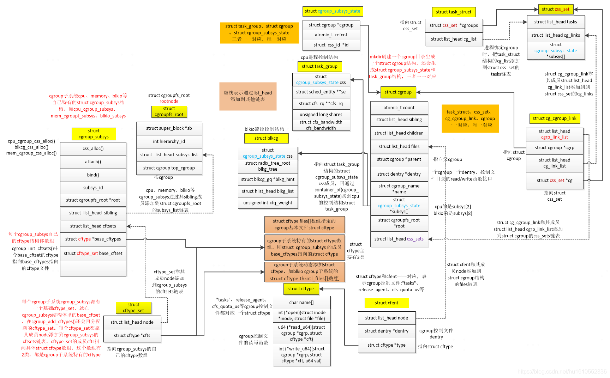

* content
{:toc}

# cgroup

cgroup is largely composed of two parts - the core and controllers. cgroup core is primarily responsible for hierarchically organizing processes.  A cgroup controller is usually responsible for distributing a specific type of system resource along the hierarchy although there are utility controllers which serve purposes other than resource distribution.

cgroup主要由两部分组成&核心和控制器。cgroup core主要负责分层组织进程。cgroup控制器通常负责沿层次结构分发特定类型的系统资源，尽管有一些实用程序控制器用于除资源分配。

