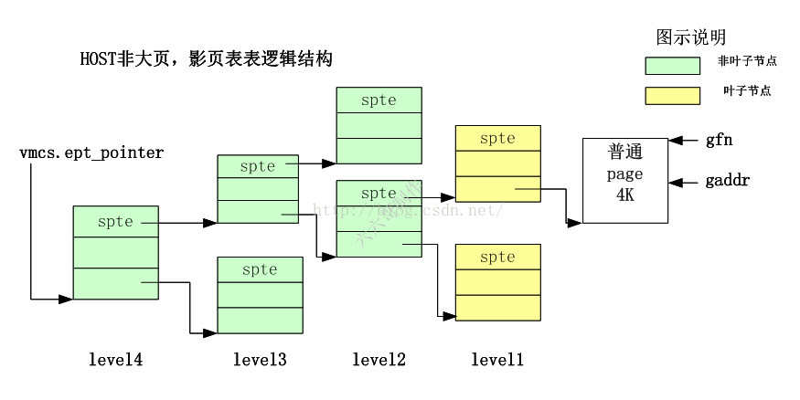
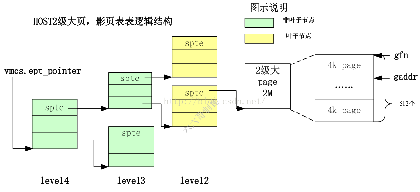
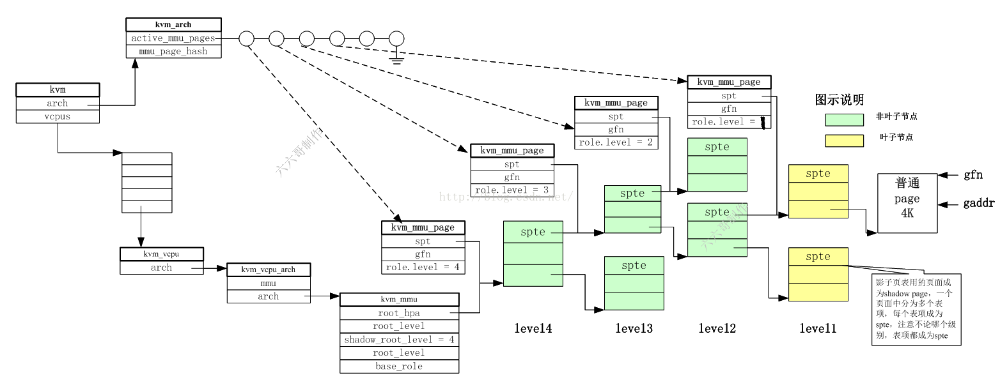
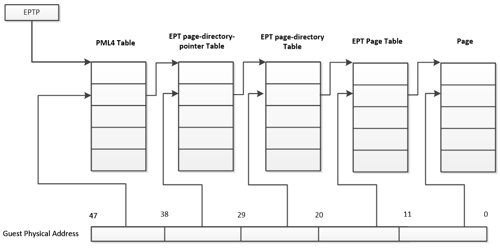

**PML4T——PDPT——PDT——PT——page**

- PML4T(Page Map Level4 Table)及表内的PML4E结构，每个表为4K，内含512个PML4E结构，每个8字节
- PDPT (Page Directory Pointer Table)及表内的PDPTE结构，每个表4K，内含512个PDPTE结构，每个8字节
- PDT (Page Directory Table) 及表内的PDE结构，每个表4K，内含512个PDE结构，每个8字节
- PT(Page Table)及表内额PTE结构，每个表4K，内含512个PTE结构，每个8字节。

## Host未开启大页情况下

- gaddr就是发生EPT voilation的guest物理地址，GFN就是gaddr对应的页框号

- 转换公式如下 gfn = gaddr / PAGE_SIZE。

## Host开启2M大页情况下

在2M大页的情况下，一个大页内可以包含512个小页。

通过KVM_PAGES_PER_HPAGE(level)宏可以获得

1. ​	gfn_t gfn = gpa >> PAGE_SHIFT; 
2. ......
3. ​	level = mapping_level(vcpu, gfn);
4. ​	gfn &= ~(KVM_PAGES_PER_HPAGE(level) - 1);

## 数据结构与影子页表关系

### kvm_mmu

root_hpa : 影子页表level4页表页物理地址，EPT情况下，该值就是VMCS的EPT_pointer
root_level: guest中页表的级别，根据VCPU特性不同而不同，如开启long mode就是4，开启PAE的就是3等等
shadow_root_level=4：就是影子页表的级数，EPT情况下这个是4
base_role：里面设置了vMMU角色所代表的一些硬件特性，如是否开启了NX，是否开启了SMEP等

### kvm_mmu_page

spt：指向影子页表页，页中被分为多个spte。影子页表用的页面成为shadow page，一个页面中分为多个表项，每个表项成为spte，注意不论哪个级别，表项都成为spte
role.level: kvm_mmu_page结构管理的页面可以作为影子页表中任何一个level的页表。也就是影子页表所代表的角色不同，有时候是level1 有时候是level4。其所管理的页面被用作哪个界别是靠role.level区分的。
gfn: 每级的页表页都会管理GUEST物理地址空间的一部分，这段GUEST物理地址空间的起止地址对应的GFN就在这个成员中被记录下来。当通过gaddr遍历影子页表页的时候，就会根据gaddr算出gfn，然后看gfn落在每级中的哪个spte内，从而确定使用哪个spte，然后用spte来定位出下一级页表地址或pfn

PT_PAGE_SIZE_MASK 第七位表明pte的SZ位置位

## PTE格式

1. M is an abbreviation for MAXPHYADDR.

① 当MAXPHYADDR为52位时，上一级table entry的12~51位提供下一级table物理基地址的高40位，低12位补零，达到基地址在4K边界对齐；

② 当MAXPHYADDR为40位时，上一级table entry的12~39位提供下一级table物理基地址的高28位，此时40~51是保留位，必须置0，低12位补零，达到基地址在4K边界对齐；

③ 当MAXPHYADDR为36位时，上一级table entry的12~35位提供下一级table物理基地址的高24位，此时36~51是保留位，必须置0，低12位补零，达到基地址在4K边界对齐。

MAXPHYADDR为36位正是普通32位机的PAE模式。

假设客户机有m级页表，宿主机EPT/NPT有n=4级，在TLB均miss的最坏情况下，会产生m*n次内存访问，完成一次客户机的地址翻译。

