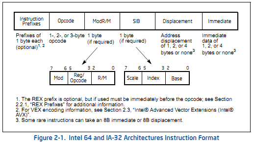
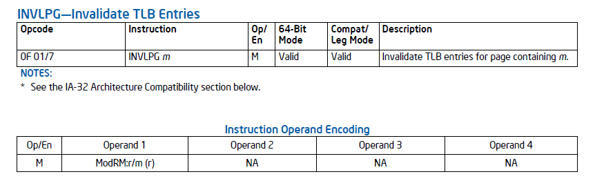
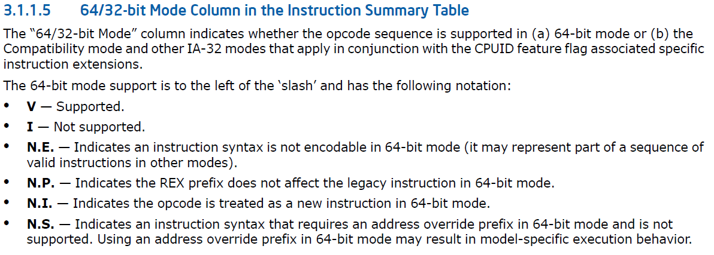
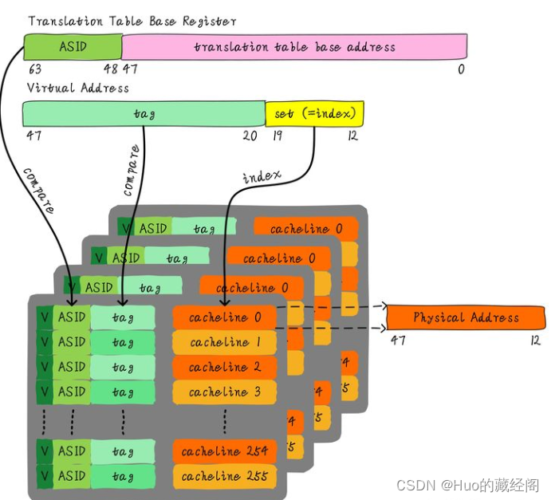

## 指令格式

每条intel指令由六个部分组成

## INVLPG指令

使m指定地址的TLB entry失效，一般地址指定的TLB是一个，该指令也会invalidate global TLB

void native_flush_tlb_one_user(unsigned long addr)

​	asm volatile("invlpg (%0)" ::"r" (addr) : "memory");

**将当前运行的进程中的addr地址 对应转换关系 在TLB设置为无效，以重新更新该转换关系。**

## TLB invalidate操作

有很多操作可以invalidate TLB entry和paging-structure caches，包括：

1. INVLPG。该指令接线性地址作为参数，invalidate当前PCID中线性地址相应的page对应的TLB entry，也能invalidate相应page对应的global TLB entry。
2. INVPCID。针对PCID相关的invalidate操作，分为4个类型，后面单独描述。
3. mov to CR0。当将CR0.PG(是否启用分页机制)从1修改为0时，该操作invlidate掉所有的TLB entry(包括global entry)，和所有的paging-structures entry。
4. mov to CR3。熟悉的操作。分多种情况：
   - 如果PCID关闭的话(CR4.PCIDE = 0)，会flush掉(invalidate)所有的TLB
   - 如果PCID开启的话(CR4.PCIDE = 1)，当NOFLUSH bit(CR3最高位，63bit)设置时，不会进行flush操作; 当NOFLUSH bit(CR3最高位，63bit)未设置时，会flush掉(invalidate)当前PCID(CR3的低12位)对应的TLB entry。
5. mov to CR4。用的不多，具体不说了，详见SDM。
6. Task Switch。本质为mov to CR3。
7. VMX transitions. 也不说了，参见SDM 4.11.1.

另外，也是非常重要的一点：缺页异常也会自动(硬件)invalate 相关TLB和paging-structure caches。

## Global Pages

Intel-64和IA-32 architectures允许使用global pages，通过CR4.PGE(bit 7)控制。当允许使用global page时，如果PTE中的G flag(bit 8)设置，则相应的TLB entry被视作为global(但不影响paging-structure caches)。CPU可以使用全局TLB entry，即使不关联当前的PCID。

global page feature允许经常使用的pages或者共享pages被标记为global to all users；上下文任务切换或者写寄存器CR3时，global pages不从TLB中flush出去；

global TLB entry在没有PCID时，进行mov to CR3操作(也就是进程切换时)，不会被flush掉。在引入PTI特性之前，所有的内核地址空间对应的映射都被设置为global，如果可以避免在进程切换时flush掉内核态地址空间对应的TLB entry，可以很大程度提升性功能。

## PCID减少TLB flush的原理

简单说：在没有PCID的环境中，TLB是全局的(针对当前CPU)，即所有在当前CPU上运行的所有进程共享所有的TLB entry，那么当进程切换时，则必须flush掉所有的TLB(因为不同的进程的地址映射是不同的，独立的)；引入PCID后，即将所有的TLB entry通过PCID进行分类，不同PCID对应不同的进程，那么不同的进程就可以使用自己的独立的TLB entry，进程间互不影响和干扰，如此在进程切换时，就可以不flush TLB(当下一个进程使用PCID在TLB中还存在时，就是说刚切换出去不久后，再次切换回来)，或者只flush掉下一个进程的PCID对应的TLB entry(避免冲突)，如此即可在上下文切换时减少TLB flush操作，从而减少tlb miss，同时减少了TLB flush操作本身带来的性能开销。因此，达到提升性能的目的。

## PCID会降低性能？为啥？

再仔细想想，为啥PCID使用后反而会降低性能呢？

关键的几点：（大家理解）

1. X86中的PCID是12位，也就是总共最多只能有4096个pcid，而pcid是用来标示进程的，也就是说，每个进程都有自己对应的唯一的PCID，但是PCID总共就4096个，当进程数量超过4096个以后，该怎么办呢？只能将所有的TLB都flush掉，然后重新分配所有的PCID，这个过程是比较费劲的。对于现代CPU来说，核数越来越多，有些服务器环境的CPU核甚至超过了4096，这种情况下，PCID会处于严重的不够用状态，导致TLB被反复flush，这种情况下，性能下降尤为明显。
2. 将所有的TLB entry按PCID进行划分，假设每CPU上的TLB entry个数位4096个，如果将4096个PCID用完，那么平均每个PCID只能分到1个entry，这个显然有问题，几乎相当于没有TLB，这种情况下，性能下降是可以想象的。即使PCID不用完，那么每个PCID能用到的TLB entry数量也会减少很多，举个例子：在没有PCID之前，每个进程都是独享所有的TLB entry的，那么，显然此时TLB充足，对于当前进程来说，能最大程度的利用TLB，因此能提升性能。但当进程数量比较多，进程切换比较频繁时，由于每次切换都需要flush掉所有TLB，切换成本比较高；在引入PCID之后，每个进程享用的TLB数量变少，所以可能会出现不够用的情况，导致性能降低，但由于上下文切换时可以减少一部分TLB flush，所以切换成本会降低。因此，很显然，这是一个辩证过程，PCID没有绝对的优势和劣势，取决于具体的应用场景，以及PCID的分配和使用策励，也就是说，如果使用得当，性能会有更好的发挥，反之，则会让性能更糟糕。
3. 引入PCID后，并不意味着在进程切换时就不进行TLB flush操作了。需要理解本质，其实在引入PCID后，TLB显然还是需要flush的，只是每次flush的数量、以及flush的时机。引入PCID后，在没有其他优化机制的情况下，每次进程切换时，只flush掉当前PCID对应的TLB entry，也就是减少了每次flush的数量，如此能减少flush的成本，但同时由于可用的TLB entry变少了，也可能会增加TLB miss的概率。另一方面，即使在一些条件下可以不进行flush操作，能节省更多的成本，但是当TLB entry用完后，总是需要flush的(可能由硬件自己完成)，所以flush是不可避免的，需要把握 **度**。

## 合理使用PCID

如上节描述，PCID需要合理使用，才能发挥更佳的性能，那么如何才算合理，Linux需要面临的业务场景实在太多，要设计出满足所有的场景的 **合理设计** 其实非常困难。当前内核中针对PCID使用方式的优化，主要两个，还算是比较通用。

1. 使用少量的PCID。当前内核中使用的PCID数量为6个(当开启PTI时，为12个)，并没有完整的使用4096个，6个在当前各种应用场景中，能较好的体现PCID的优势。（但是否还能优化？大家可以尝试、思考下）
2. 记录最近使用的PCID。当前内核通过记录最近使用的PCID(其实也就是这6个使用的PCID)，来控制是否在进程切换时进行当前PCID对应的TLB flush操作。如果是最近使用过的PCID，那么就可以直接利用之前TLB中的缓存，避免flush，如此可以提升性能。

## pti

pti，即Page Table Isolation，previously known as KAISER。

其主要思想：让内核态和用户态使用独立的页表。确切的说，每个进程拥有两张页表：用户态页表和内核态页表，当用户态和内核态切换时，同时切换相应页表。

如此，由于使用独立页表，那么内核态和用户态地址则分别处于不同的TLB context中，如此，用户态再无法通过**CPU的预测执行**来访问内核态地址了，即可规避掉Meltdown漏洞。

用户态页表中包含很少的内核地址映射，这部分地址用于**进入/退出**内核，比如entry/exit functions和中断描述符表(IDT)。这些内核数据都被包含在了 **cpu_entry_area** 数据结构中，而这个数据结构被放在了fixmap区域

## 独享虚拟机

只有独享虚拟机进程和OS其他进程，是否可以设置PCID，提高独享虚拟机的性能

后续再看static void FNAME(invlpg)(struct kvm_vcpu *vcpu, gva_t gva, hpa_t root_hpa)

需要内存虚拟化的相关知识

### VMRUN

**当执行VMRUN指令是，可以通过VMCB中的TLB_CONTROL字段控制要求触发刷新TLB，该命令主要在虚拟化场景使用，不再详细描述**