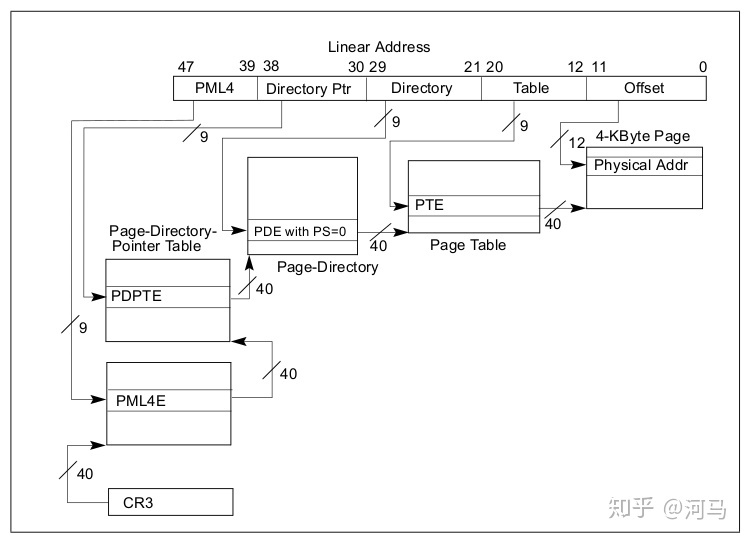
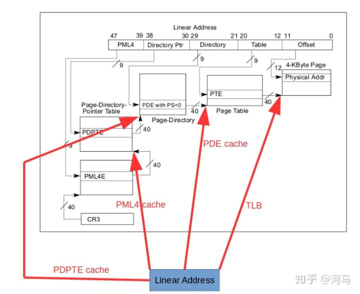
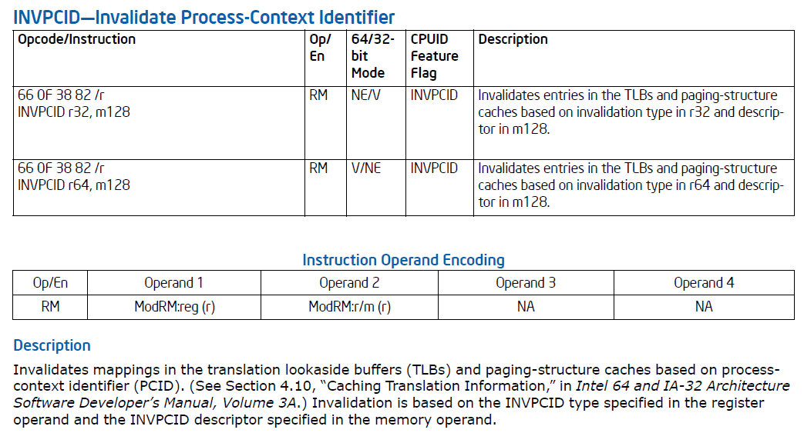
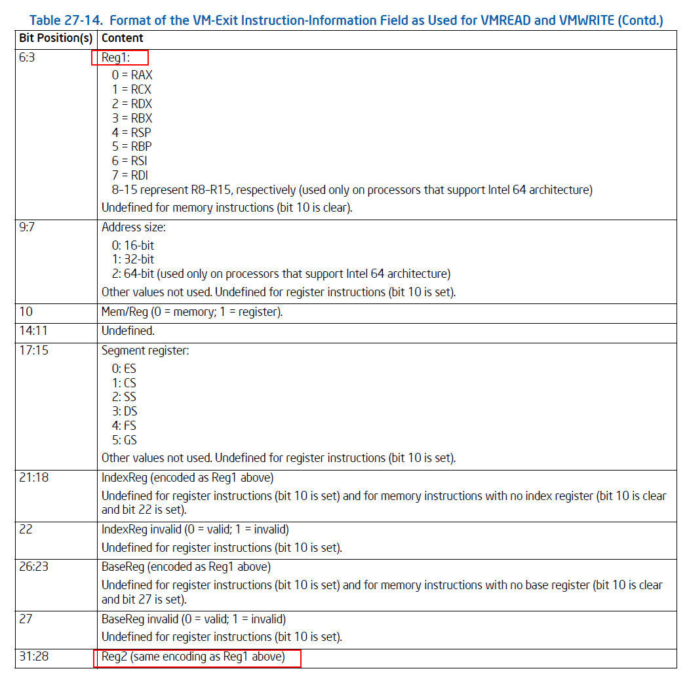

# 分页机制


## x86使用4级分页机制

CR3->PML4->PDPT->PD->PT->4kPage



没有任何加速的情况下，一次线性地址访问需要**4次页表访问**和**一次最终物理地址访问**。

## Cache加速

- cache物理内存——L1、L2、L3 cache
- 缓存页表加速地址转换——TLB和Paging-Structure Cache
- TLB：
  - 直接将线性地址的高位（即page number）直接转换到物理内存页（即page frame）基地址
  - 一次索引就可以获取物理地址，只需要**一次最终物理地址访问**
- Paging-Structure Cache
  - 缓存地址转换页表，包含PML4E cache、PDPTE cache、PDE cache
  - 可以将TLB看做是PTE cache，因为TLB可以直接转换为物理地址





## 不同进程的cache可以同时保存在cache中

- 进程切换时不再进行flush操作，且可以保存多个进程的cache，提高性能
- 为此引入了PCID（Processor Context ID）
- 当CPU内部查找地址转换的cache的时候，会先对cache里面的PCID信息和当前的PCID，即存放的CR3寄存器的11:0的值做比较，只有两个地方的PCID相等，CPU才可能会采用该cache项。


## PCID也称为ASID，在Linux 中使用ASID术语

- 将当前分配的ASID存储到单独的结构中，进程需要的时候动态分配给进程
- 处于非活动状态的进程将不会分配ASID（大多数休眠进程不会消耗ASID，所有分配的ASID都在相同数据结构中，方便cache）
- Linux仅记住最后TLB_NR_DYN_ASIDS=6个ASID，6个刚好使tlb_state占用2个cache line

```C
struct tlb_context {    
	u64 ctx_id;    
	u64 tlb_gen; 
};  
struct tlb_state {      .     .     .     
	u16 next_asid;     
	struct tlb_context ctxs[TLB_NR_DYN_ASIDS]; 
}; 
DECLARE_PER_CPU_SHARED_ALIGNED(struct tlb_state, cpu_tlbstate);
```


- 内核中使用ASID，uPCID，kPCID等概念，需要进行区分：
  - ASID - [0, TLB_NR_DYN_ASIDS-1]，即0-5, 对应于传统的asid标识。
  - kPCID - [1, TLB_NR_DYN_ASIDS]，即1-6,内核态pcid，为实际写入CR3中的id，**实际为asid+1，因为pcid=0有特殊用途**。
  - uPCID - [2048 + 1, 2048 + TLB_NR_DYN_ASIDS]，即2049-2054，用户态pcid，**实际为kPCID+2048**，其实就是将PCID中的最高位(也就是CR3中的bit 11)置为1即可。

- 每个进程都有一个ASID,与kPCID和uPCID关联，它们是实际存储在CR3.PCID中的值。
- 每个进程具有两个ASID的原因是为了支持页表隔离（PTI），从而减轻了Meltdown漏洞。


## Linux进程切换

- Linux在进程切换时为进程动态分配ASID
  - 如果线程被中断或执行了系统调用，退出时如果调度到同一线程或同一进程的其他线程，会使用相同的ASID
  - 如果调度到其他进程，Linux会分配一个其他ASID
- 同一进程的不同线程可能在不同CPU上获得不同ASID，且进程切换时可能会动态更改


## TLB invalidate操作

- INVLPG 线性地址——invalidate当前PCID中的线性地址对应的TLB
- INVPCID
  - 0、INVPCID_TYPE_INDIV_ADDR——invalidate单个线性地址
  - 1、INVPCID_TYPE_SINGLE_CTXT——invalidate指定PCID下的所有地址
  - 2、INVPCID_TYPE_ALL_INCL_GLOBAL——invalidate所有PCID所有条目包括globals
  - 3、INVPCID_TYPE_ALL_NON_GLOBAL——invalidate所有PCID所有条目不包括globals


    static inline void __invpcid(unsigned long pcid, unsigned long addr,
                                 unsigned long type)
        struct { u64 d[2]; } desc = { { pcid, addr } };
        asm volatile("invpcid %[desc], %[type]"
                     :: [desc] "m" (desc), [type] "r" (type) : "memory");




handle_pcid

```c
先通过vmread读VMX_INSTRUCTION_INFO即VM-Exit Instruction Info    
vmx_instruction_info = vmcs_read32(VMX_INSTRUCTION_INFO);

再获取造成VM-Exit的指令的参数，这里获取第二个参数即上面的Operand 2，这里总感觉应该是第一个参数，难道是因为函数压栈的原因，最后一个参数先压栈
gpr_index = vmx_get_instr_info_reg2(vmx_instruction_info);

获取寄存器中的值，可以得到Operand1中的值，即虚拟机内执行invpcid时的参数type
    type = kvm_register_read(vcpu, gpr_index);
    VMX_INSTRUCTION_INFO            = 0x0000440e,

获取内存参数Operand2，放入gva中
get_vmx_mem_address(vcpu, vmx_get_exit_qual(vcpu),   gva);

调用
kvm_handle_invpcid执行操作
                    
         
```





