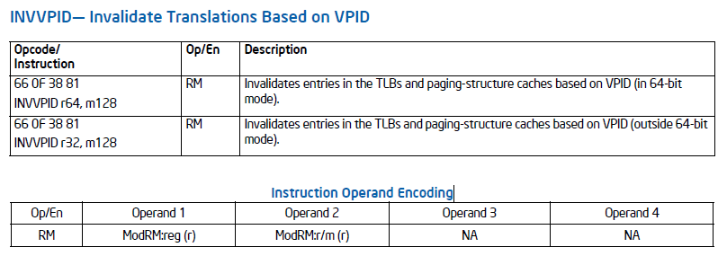
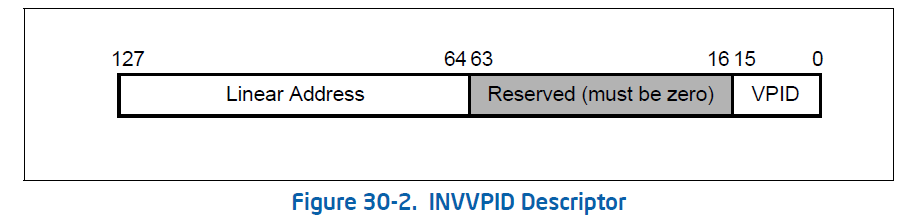
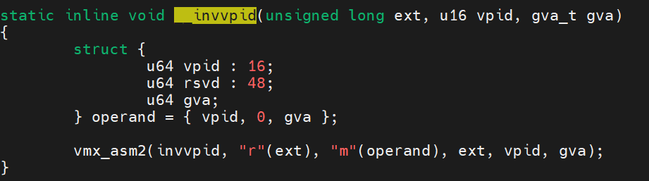

# VPID（Virtual Processor ID）

## EPT地址转换

GVA——GPA——HPA

- 软件模式：

  - 每次对CR3和页表的访问都退出到VMM，VMM将两次地址转换的页表结合起来形成影子页表
  - 每次访问都需要陷出，效率问题
  - VMM需要为**每个虚拟机*每个进程**维护页表，占用内存资源

- EPT硬件模式：

  - EPT将GPA转化为HPA

  - VMM仅需要为**每个虚拟机**维护页表，VMM负责设置EPT所需的页表入口地址，存放在VMCS-EPTP中

    

## EPT也需要cache加速

- Linear mapping
  - Linear translations   类似TLB，用于GVA——GPA的转换加速
  - Linear paging-structure-cache 类似Paging-Structure Cache，用于GVA——GPA的地址转换页表加速
- Guest-physical
  - Guest-physical translations 类似TLB，用于GPA——HPA的转换加速
  - Guest-physical paging-structure-cache  类似Paging-Structure Cache，用于GPA——HPA的地址转换页表加速
- Combined mapping
  - Combined translations  类似TLB，直接用于GVA——HPA的转换加速，虚拟机的page number直接到物理机的page frame
  - Combined paging-structure-cache 类似Paging-Structure Cache，直接用于GVA——HPA的地址转页表加速
  - 这种方式VMM需要为**每个虚拟机*每个进程**维护页表，因为GVA是属于进程的

## 不同vcpu的cache可以同时保存在硬件cache中

- vcpu在每次VM Entry和VM Exit时不需要执行flush操作，且可以保存多个vcpu的cache，提高性能
- 为此引入VPID（Virtual Processor  ID）
- 为每个地址转换的Cache（TLB或者Paging-Structure Cache）打上一个VPID的标志（VMM为每个vCPU分配一个唯一的VPID（位于VMCS中），逻辑CPU的VPID为0，其他vCPU的VPID大于0）
- EPT硬件寻找cache时，将当前运行的vCPU/CPU的VPID和Cache中所包含的VPID进行匹配，只有相等才会使用该Cache条目。

## INVVPID

Invalidates mappings in the translation lookaside buffers (TLBs) and paging-structure caches based on virtualprocessor identifier (VPID). (See Chapter 28, “VMX Support for Address Translation”.) Invalidation is based on the INVVPID type specified in the register operand and the INVVPID descriptor specified in the memory operand.

第一个是寄存器参数，表示类型，第二个内存参数表示描述符

- **INVVPID**支持四种类型，与**INVPCID**的操作保持一致：
    - INVVPID
        - #define **VMX_VPID_EXTENT_INDIVIDUAL_ADDR**         0
            #define VMX_VPID_EXTENT_SINGLE_CONTEXT          1
            #define VMX_VPID_EXTENT_ALL_CONTEXT             2
            #define VMX_VPID_EXTENT_SINGLE_NON_GLOBAL       3
    - 
    - INVPCID
        - 0、INVPCID_TYPE_INDIV_ADDR——invalidate单个线性地址
        - 1、INVPCID_TYPE_SINGLE_CTXT——invalidate指定PCID下的所有地址
        - 2、INVPCID_TYPE_ALL_INCL_GLOBAL——invalidate所有PCID所有条目包括globals
        - 3、INVPCID_TYPE_ALL_NON_GLOBAL——invalidate所有PCID所有条目不包括globals

- handle_invlpg 虚拟机内部的tlb缓存失效，是通过INVVPID实现的
    - kvm_mmu_invalidate_gva
        - if (mmu != &vcpu->arch.guest_mmu) {
        - static_call(kvm_x86_flush_tlb_gva)
        - 实际调用kvm_x86_ops **vmx_x86_ops**->flush_tlb_gva = **vmx_flush_tlb_gva**
            - 通过vpid_sync_vcpu_addr调用invvpid将进程的**gva_t地址**flush掉
                - __invvpid(**VMX_VPID_EXTENT_INDIVIDUAL_ADDR**, vpid, addr);

- handle_invpcid 虚拟机内部的tlb缓存失效，通过INVVPID实现
    - handle_invpcid 先获取虚拟机内部invpcid指令的两个参数
    - kvm_register_read获取第一个type参数
    - get_vmx_mem_address获取第二个gva参数
        - kvm_read_guest_virt 
            - gva_to_gpa获取gva地址里的内容，需要软件遍历虚拟机的页表获得gpa
            - kvm_vcpu_read_guest_page 再讲gpa转化为hva进行读取
        - 根据type类型如果只invalidate一个gva地址，调用kvm_mmu_invpcid_gva 
            - mmu->invlpg  TDP时为NULL
            - static_call(kvm_x86_flush_tlb_gva)即**vmx_flush_tlb_gva**

