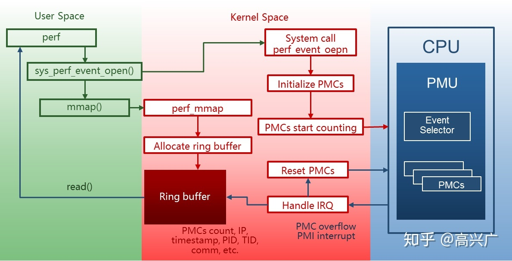

## 性能监测

### perf采样事件——perf list查看

PMU硬件产生的事件——cache命中

内核软件产生的事件——进程切换，tick

内核中静态tracepoint触发的事件——tracepoint

### perf的两种模式

计数模式：perf stat

采样模式：perf record

### 性能事件的属性

硬件性能事件由处理器中的PMU提供支持。从性能事件被触发，到处理器响应 PMI中断，流水线上可能已处理过数百条指令。

PMI中断采到的指令地址就不再是触发性能事件的那条指令的地址了，可能具有非常严重的偏差。

PEBS通过硬件在计数器溢出时将处理器现场直接保存到内存，从而提高精度

级别描述
0 无精度保证
1 采样指令与触发性能事件的指令之间的偏差为常数（:p）
2 需要尽量保证采样指令与触发性能事件的指令之间的偏差为0（:pp）
3 保证采样指令与触发性能事件的指令之间的偏差必须为0（:ppp）

标志属性
u 仅统计用户空间程序触发的性能事件
k 仅统计内核触发的性能事件
h 仅统计Hypervisor触发的性能事件
G 在KVM虚拟机中，仅统计Guest系统触发的性能事件
H 仅统计 Host 系统触发的性能事件
p 精度级别

perf kvm stat live -p 29309

