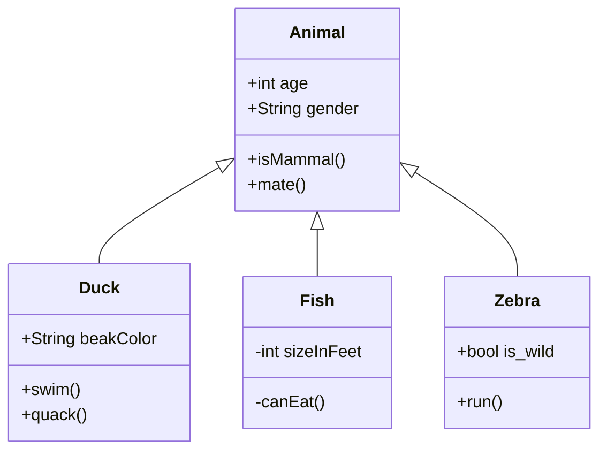
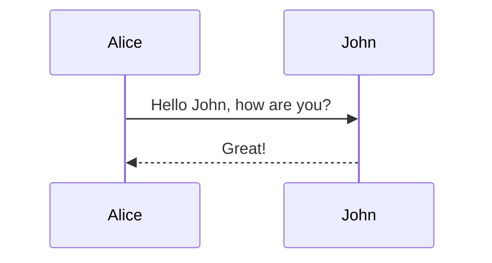
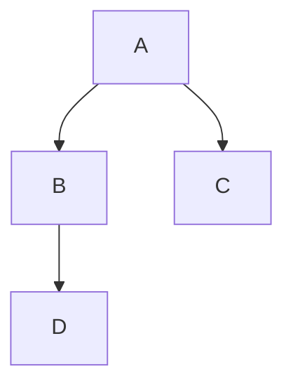
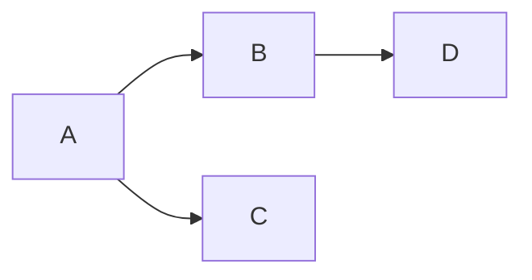
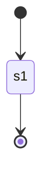
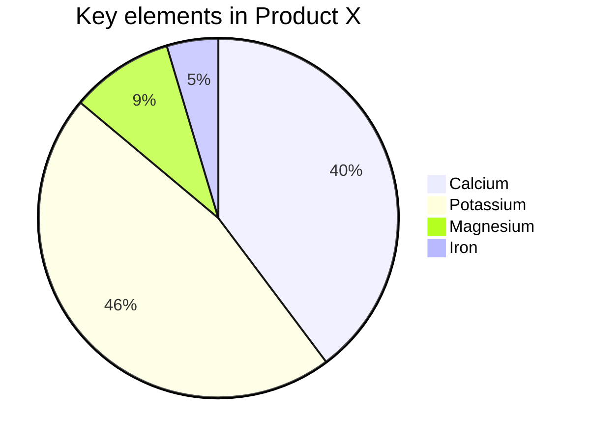
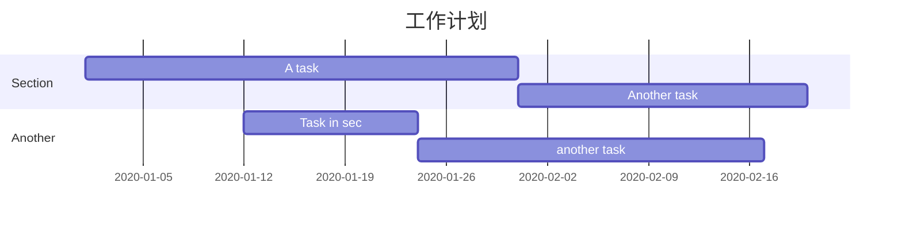

类图

```mermaid
classDiagram
      Animal <|-- Duck
      Animal <|-- Fish
      Animal <|-- Zebra
      Animal : +int age
      Animal : +String gender
      Animal: +isMammal()
      Animal: +mate()
      class Duck{
          +String beakColor
          +swim()
          +quack()
      }
      class Fish{
          -int sizeInFeet
          -canEat()
      }
      class Zebra{
          +bool is_wild
          +run()
      }
```

顺序图

```mermaid
sequenceDiagram
    Alice->>John: Hello John, how are you?
    John-->>Alice: Great!


```

上下图

```mermaid
graph TB;
    A-->B;
    A-->C;
    B-->D;
```
左右图

```mermaid
graph LR;
    A-->B;
    A-->C;
    B-->D;
```

状态图

```mermaid
stateDiagram
    [*] --> s1
    s1 --> [*]
```

饼图

```mermaid
pie
    title Key elements in Product X
    "Calcium" : 42.96
    "Potassium" : 50.05
    "Magnesium" : 10.01
    "Iron" :  5
```

甘特图

```mermaid
gantt
    title 工作计划
    dateFormat  YYYY-MM-DD
    section Section
    A task           :a1, 2020-01-01, 30d
    Another task     :after a1  , 20d
    section Another
    Task in sec      :2020-01-12  , 12d
    another task      : 24d
```

